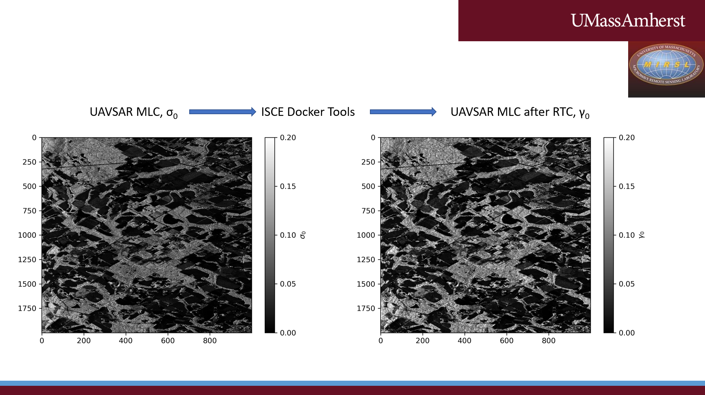

# ISCE Docker Tools: Automated Radiometric Terrain Correction and Image Coregistration of UAVSAR MLC DATA

This workflow uses two or more UAVSAR MLC datasets as input to generate a co-registered stack of images that had been corrected for viewing geometry and terrain effects (gamma0).
The workflow is to be used in conjunction with a Docker container that has a slightly modified version of ISCE installed on it, to facilitate MLC processing. More details on ISCE are available at [https://github.com/isce-framework/]().

## 4/4/20: The ISCE Docker Tools workflow scripts for UAVSAR MLC processing was updated to also work with the simulated NISAR MLC Data (tested with 129A and 129B, should work for all of them), available at https://uavsar.jpl.nasa.gov/cgi-bin/data.pl)

1. Please note that one must set the parameter simrun = 1 in run_ctrl.py if simulated NISAR data is to be used.

2. The NISAR simulated data needs to be renamed to be properly read by our ISCE Docker Tool. A download + renaming tool with directions is provided in the uavsar_simulated_directory.

## Pre-requisites
- an EARTHDATA account at [https://urs.earthdata.nasa.gov/](), used to download the digital elevation model files
- Docker. To install Docker on your system, follow directions at [https://docs.docker.com/](https://docs.docker.com/)

## Steps
1. Install the docker image of ISCE (modified for RTC)
  - download the Docker_Install folder from Box
  - unzip folder, cd into "Docker_Install" and run "docker build -t imgname ." where imgname is a custom name on the command line. This will install a Docker image on your system. 
  - "docker image ls", and note the IMAGE ID value (copy/paste)
  - alternatively if we've put the image on the Docker repository, you may use "docker pull MIRSL/"

2. Set-up of the processor on your system
  - Pick a directory on the local machine where work is to be done (<localdir>). e.g.  $HOME/work and do the following:
     - create a folder named "docker_new_runs". This is because the docker image was built using WORKDIR $HOME/uavsar_mlcproc/docker_new_runs. 
        This can be overridden by (i) rebuilding the Docker image with different value for WORKDIR; (ii) override on the command line with the option -w="$HOME/uavsar_mlcproc/XXX" (XXX is dir name)
     - copy the workflow .py scripts (in workflow_scripts dir on box) into "docker_new_runs" (i.e. 0_ann_dem.py, 1_iscestack.py, 2_resamp_pol.py, 3_uavsar_pp_mlc.py, run_ctrl.py)
     - note: ensure that the python scripts have the correct permissions ... they need to be executable
     - You will need to create a file named .netrc in "docker_new_runs"
        "machine urs.earthdata.nasa.gov login <login> password <password>"
        - Windows doesn't easily let you make filenames starting with '.' but the below line works (run from a cmd window)
        "echo machine urs.earthdata.nasa.gov login <login> password <password> > .netrc
         (More information at [https://lpdaac.usgs.gov/resources/e-learning/how-access-lp-daac-data-command-line/]())
     - Place the MLC UAVSAR zip files (don't unzip them) in "docker_new_runs", e.g. downloaded from[ https://uavsar.jpl.nasa.gov/]()

3. Data processing (if running on linux, please see the note below)
    - launch Docker
    - type docker image ls and note the IMAGE ID for the ISCE Docker Tools image
    - in a terminal, type "docker run -it --rm -v <localdir>:/work/uavsar_mlcproc <IMAGE ID>" to launch the processing
 
  ### Note

If running this on linux: on the first try, you will get a permission error. This is because docker the container is running as a different user on the container (i.e. as root) than on the user's OS. In the beginning, the processor creates new directories and moves the python scripts to these subdirectories, and the run_ctrl.py script won't be able to launch the scripts placed in those folders. A workaround is to create the directory structure used ahead of time; or to let step (c) fail and then chmod the directories  <localdir>/flightName and its subdirectories to the correct permissions. It is not ideal that the container runs as root but it is in line with the processor is set up for cloud processing. 

In addition to the python scripts, we provide the dockerfile with the ancillary updated ISCE data required to run the MLC processor so that users may build the container to suit their needs.

Note: If one wants to use a digital elevation model from another source, we provided an example for how OpenTopography can be used for this purpose. It is part of the 0_ann_dem.py script, in the elif clause starting line 291.

